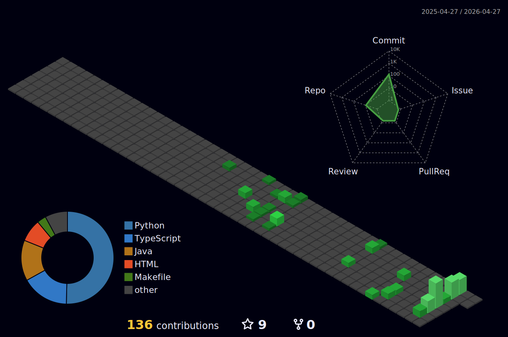

<!-- Header — adapts to light/dark mode -->
<picture>
  <source media="(prefers-color-scheme: dark)" srcset="./header.svg">
  <source media="(prefers-color-scheme: light)" srcset="./header.svg">
  
</picture>

<div align="center">

[](https://git.io/typing-svg)

</div>

---

## `> contacts --list`

<div align="center">

[](mailto:lucas@lucas-jacob.com)
[](https://linkedin.com/in/lucas-jacob)
[](https://lucas-jacob.com)
[](https://discord.com/)
[](https://twitch.tv/)

</div>

---

## `> stack --verbose`

<div align="center">

**⚔️ Languages**


**🖥️ Frontend**


**⚙️ Backend & Frameworks**


**🧠 Data & AI**


**🛠 DevOps & Tools**


</div>

---

## `> ls ./projects`

<table>
<tr>
<td width="50%">

### ⚡ VOLT
> High-performance energy monitoring platform
>
> `React` `Node.js` `PostgreSQL` `Docker`
>
> [→ View Repo](https://github.com/alterax-code/volt)

</td>
<td width="50%">

### 🛡️ PrankGuard
> AI-powered content moderation & prank detection
>
> `Python` `Machine Learning` `FastAPI`
>
> [→ View Repo](https://github.com/alterax-code/prankguard)

</td>
</tr>
<tr>
<td width="50%">

### 🥊 Fist of Steel
> Multiplayer fighting game with real-time networking
>
> `TypeScript` `WebSocket` `Canvas API`
>
> [→ View Repo](https://github.com/alterax-code/fist-of-steel)

</td>
<td width="50%">

### 🎙️ RTC-Discord-Clone
> Real-time communication app inspired by Discord
>
> `TypeScript` `WebRTC` `Socket.io`
>
> [→ View Repo](https://github.com/alterax-code/RTC-Discord-Clone)

</td>
</tr>
</table>

---

## `> stats --github`

<div align="center">


</div>

<div align="center">


</div>

---

## `> contrib --3d`

<!-- 3D Contribution Calendar — auto-generated by GitHub Action -->
<div align="center">



</div>

---

## `> contrib --snake`

<!-- Snake animation — auto-generated by GitHub Action -->
<div align="center">

<picture>
  <source media="(prefers-color-scheme: dark)" srcset="https://raw.githubusercontent.com/alterax-code/alterax-code/output/github-snake-dark.svg" />
  <source media="(prefers-color-scheme: light)" srcset="https://raw.githubusercontent.com/alterax-code/alterax-code/output/github-snake.svg" />
  
</picture>

</div>

---

## `> activity --graph`

<div align="center">


</div>

---

<div align="center">


```
⚰️ Atypical path. Relentless grind. Same destination.
```

</div>
